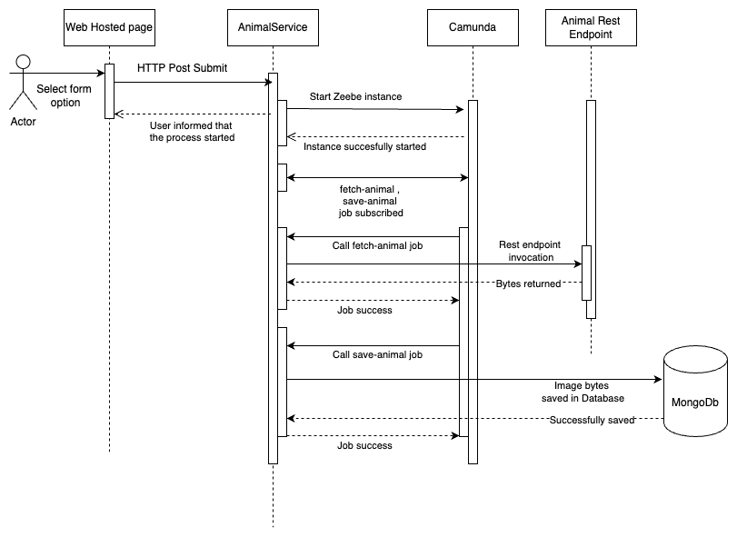

# Camunda 8 animal service demo

The self contained process consists of 

* A sample [Camunda form](https://docs.camunda.io/docs/components/modeler/forms/camunda-forms-reference/)
* A simple HTML website using [form-js](https://bpmn.io/toolkit/form-js/) to render the form and submit it on request
* REST endpoint to take the data from the form and start a process instance. The process is defined in `src/main/resources/model/animal-picture-bpmn.bpmn`
* The process consists of 2 services.
  * Fetch animal
  * Save animal details
* Two job workers are defined in `AnimalWorker.java` class which maps to the above service.
  * **fetch-animal** : This will fetch animal as per the type from Rest API call.
  * **save-animal** : This will then save the image in MongoDb database with unique ID.
* Application is containerized usign DockerFile

## Sequence flow :


## Requirements:

* Camunda Platform 8
* Java >= 21
* Maven

## How to run

* Download/clone the code in this folder.
* Add API client connection details in the file `application.properties`. Simply
  replace the existing sample values.
* Add mongodb database credentials. For simplicity I have provided my mongodb cloud db settings
* Run the application:

```
mvn clean install
docker build -t animaldemo:latest
docker run -i --publish 8080:8080 animaldemo:latest
```

**Goto http://localhost:8080/** and select animal. 

Please note : I didn't get enough time to complete the test cases and mock the class. I have commented out the Test code for time being.

